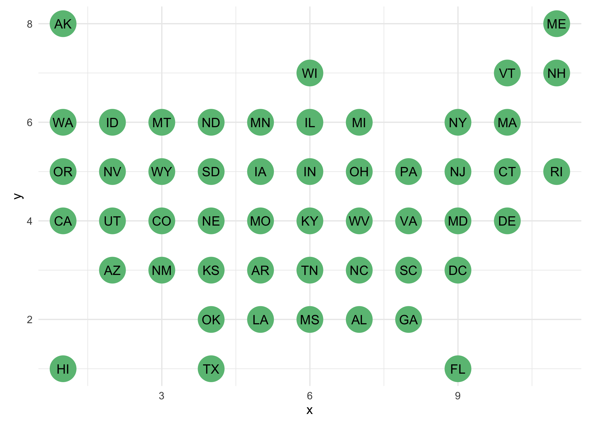
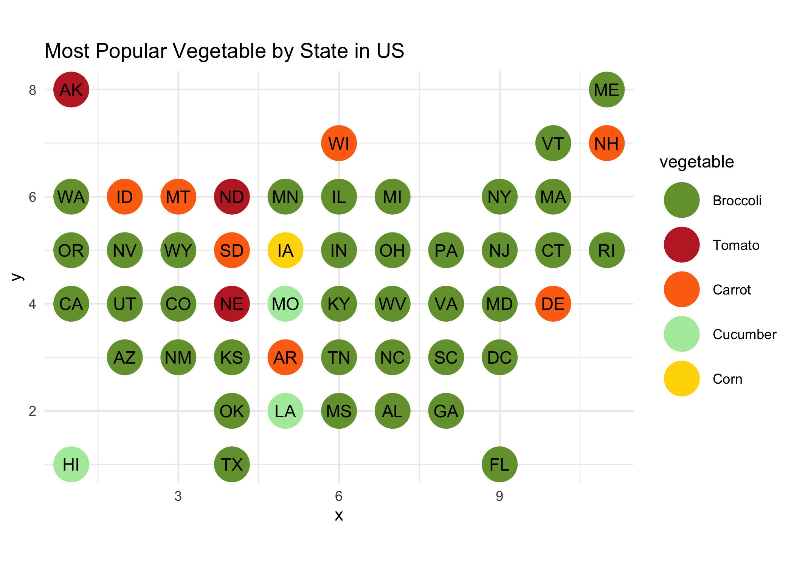
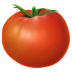
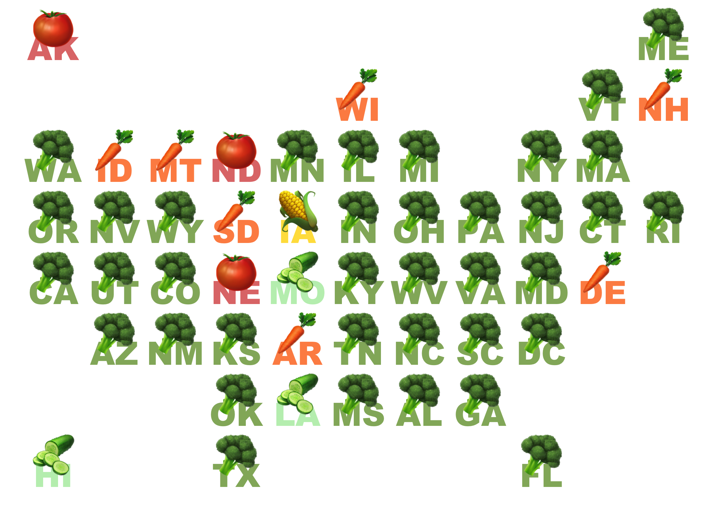
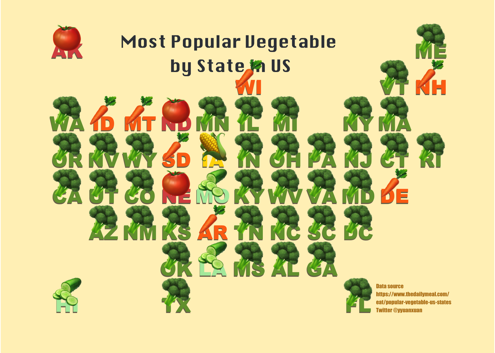
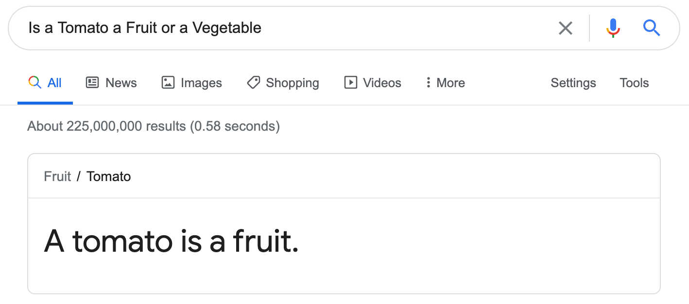
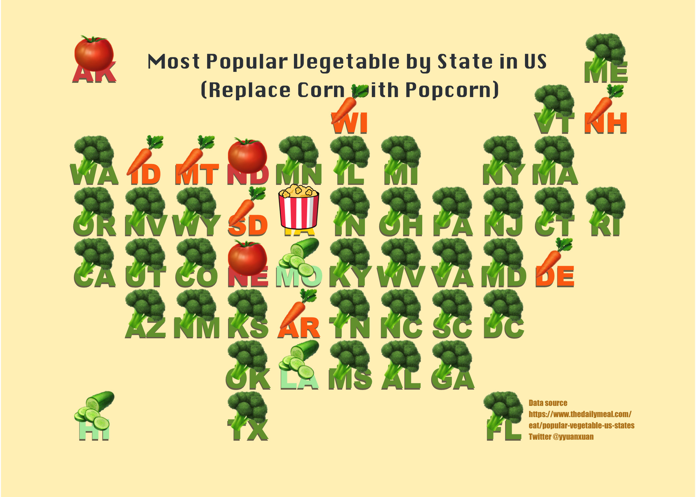

Use emoji in ggplot2 scatter plot
================
yuanxuan yang

This is a tutorial of using emoji (or other images) in ggplot2 scatter
plot. Our task is to create a map (scatter plot) to show the “most
popular vegetable by state in US”, where each state is represented by
vegetable emoji. It would be good to generate some visual outputs
similar to the grid maps as shown in [this
article](https://flowingdata.com/2015/05/12/the-great-grid-map-debate-of-2015/).

### 1. Get the data

The **most popular vegetable data** is obtained from
<https://www.thedailymeal.com/eat/popular-vegetable-us-states>, I have
tidied up and stored the information in “data/state-fav-veg.csv” in this
[repository](https://github.com/yyuanxuan/squared-map-veg-emoji).

Now let’s load the R package and have a look at our data records.

``` r
library(tidyverse)
library(ggtext)
```

``` r
state_veg<-read.csv("data/state-fav-veg.csv")
head(state_veg)
```

    ##         name vegetable
    ## 1    Alabama  Broccoli
    ## 2     Alaska    Tomato
    ## 3    Arizona  Broccoli
    ## 4   Arkansas    Carrot
    ## 5 California  Broccoli
    ## 6   Colorado  Broccoli

Each record in the “state\_veg” contains the name and most popular
vegetable of a state in the US.

The next thing to do is to get the coordinates/location of each state.
So I followed the design of Katie Park’s work in this [twitter
post](https://twitter.com/katiepark/status/598139293509492736), and the
coordinates are stored in the “data/state-location-grid.csv”.

``` r
state_location<-read.csv("data/state-location-grid.csv") 
head(state_location)
```

    ##   code       name x y
    ## 1   AL    Alabama 7 2
    ## 2   AK     Alaska 1 8
    ## 3   AZ    Arizona 2 3
    ## 4   AR   Arkansas 5 3
    ## 5   CA California 1 4
    ## 6   CO   Colorado 3 4

Each record contains the code (Two-Letter Abbreviations), name and x, y
coordinate of a state in the US. we can have a quick look at their
location:

``` r
state_location %>%
  ggplot()+
  geom_point(aes(x=x,y=y),color="#6abe83",size=10)+
  geom_text(aes(x=x,y=y,label=code))+
  theme_minimal()+
  coord_fixed()
```

<!-- -->

We then join the **state\_veg** and **state\_location**, and make a
basic scatter plot using ggpplot2. The dot’s color represent different
vegetable types.

``` r
state_veg <- state_veg %>% 
  left_join(state_location %>% 
              dplyr::select(code,name,x,y),by = c("name"="name"))
state_veg$vegetable<-factor(state_veg$vegetable,levels = c("Broccoli", "Tomato",   "Carrot",   "Cucumber", "Corn")) 

state_veg  %>%
  ggplot()+
  geom_point(aes(x=x,y=y,color=vegetable),size=10)+
  geom_text(aes(x=x,y=y,label=code))+
  scale_color_manual(values = c("#739e3b","#C1292E","#FD7013","#AFEAAA","#FFD800"))+
  ggtitle("Most Popular Vegetable by State in US")+
  theme_minimal()+
  coord_fixed()
```

<!-- -->

### 2. Emoji Time

The scatter plot above Looks good so far, but why not replace the boring
dots with some emoji vegetables? Let’s do it!





I have tried different ways of using emoji in ggplot, although there are
approaches like
[**emojifont**](https://cran.r-project.org/web/packages/emojifont/vignettes/emojifont.html)
and [**emoGG**](https://github.com/dill/emoGG), they tend to use the
flat version of emoji. As a Apple Fanboy (not really), i prefer the
classic apple version a bit more.

So today I will go for an alternative and still very simple method -
using the **geom\_richtext** provided in **ggtext** package. This
approach is inspired by [Emil Hvitfeldt’s](https://www.hvitfeldt.me/)
brilliant [blog
post](https://www.hvitfeldt.me/blog/real-emojis-in-ggplot2/). So let’s
get started!

#### 2.1 Get the emoji

You can find and download all emoji from <https://emojipedia.org/>. Once
downloaded, we can create a dataframe to store the links/address (at
your local machine) to them, as shown below

``` r
emoji_pic<-data.frame(
  vegetable = c("Broccoli", "Tomato", "Carrot", "Cucumber", "Corn"),
  emoji_link = c("img/broccoli_1f966.png",
                 "img/tomato_1f345.png",
                 "img/carrot_1f955.png",
                 "img/cucumber_1f952.png",
                 "img/ear-of-corn_1f33d.png"
  )
)

head(emoji_pic)
```

    ##   vegetable                emoji_link
    ## 1  Broccoli    img/broccoli_1f966.png
    ## 2    Tomato      img/tomato_1f345.png
    ## 3    Carrot      img/carrot_1f955.png
    ## 4  Cucumber    img/cucumber_1f952.png
    ## 5      Corn img/ear-of-corn_1f33d.png

#### 2.2 Join the dataframe

We then need to join **state\_veg** and the **emoji\_pic** data by the
common variable of “vegetable”, as a result, each record will contain
the string of link to the emoji.

``` r
state_veg <- state_veg %>%
  left_join(emoji_pic,by = c("vegetable" = "vegetable"))
state_veg$vegetable<-factor(state_veg$vegetable,levels = c("Broccoli", "Tomato",   "Carrot",   "Cucumber", "Corn")) 
```

Once joined, our data is finally ready, let’s have a look

``` r
head(state_veg)
```

    ##         name vegetable code x y             emoji_link
    ## 1    Alabama  Broccoli   AL 7 2 img/broccoli_1f966.png
    ## 2     Alaska    Tomato   AK 1 8   img/tomato_1f345.png
    ## 3    Arizona  Broccoli   AZ 2 3 img/broccoli_1f966.png
    ## 4   Arkansas    Carrot   AR 5 3   img/carrot_1f955.png
    ## 5 California  Broccoli   CA 1 4 img/broccoli_1f966.png
    ## 6   Colorado  Broccoli   CO 3 4 img/broccoli_1f966.png

#### 2.3 Define a function to provide more infomation for your emoji images

We will use **geom\_richtext** to draw the data point in a scatter
chart, and replace the point shape with emoji. **geom\_richtext** draws
labels similar to **ggplot::geom\_label**, but formatted using basic
markdown/html. Therefore, it is possible to embed images in the richtext
labels. Here we are going to define a function so that the emoji can be
added and formatted as a resource in markdown/html.

``` r
func_link_to_img <- function(x, size = 30) {
  paste0("")
}
```

#### 2.4 Moment of Truth

Now let’s try to replace the **geom\_point** with **geom\_richtext**
using


``` r
ggplot()+
  geom_text(data = state_veg ,aes(x=x,y=(y-0.3),label=code,color=vegetable),
            size=8,alpha=0.8,family="Arial Black")+ # the Two-Letter Abbreviations of each state
  scale_color_manual(values = c("#739e3b","#d9534f","#FD7013","#AFEAAA","#FFD800"))+
  geom_richtext(data = state_veg, 
                aes(x=x,y=y,label=func_link_to_img(emoji_link)),
                fill= NA,label.color = NA)+ # remove background and outline
  theme_minimal()+
  coord_fixed()+
  theme(    axis.title=element_blank(),
            axis.text=element_blank(),
            panel.grid=element_blank(),
            strip.text=element_blank(),
            legend.position = "none",
  )
```

<!-- -->

**Hurray, it works!** So again we can make some further tweaks, add a
vintage-paper look background color, change the font style, add title
and data source info. Hope you like this imporved version!

``` r
ggplot()+
  geom_text(data = state_veg ,aes(x=x,y=(y-0.35),label=code),
            color="black",size=7,alpha=0.6,family="Arial Black")+ # add Abbreviations
  geom_text(data = state_veg ,aes(x=(x+0.01),y=(y-0.32),label=code,color=vegetable),
            size=7,alpha=1,family="Arial Black")+ # add a shade for the Abbreviations
  geom_text(aes(x=9.5,y=0.87),
            label="Data source \nhttps://www.thedailymeal.com/\neat/popular-vegetable-us-states\nTwitter @yyuanxuan",
            color="#bc8420",
            size=2,hjust = 0,family="Impact")+
  geom_text(aes(x=5.5,y=7.6),label="Most Popular Vegetable \nby State in US",color="#393E46",
            size=6,family="Silom")+
  geom_richtext(
    data = state_veg,
    aes(x=x,y=y,label=func_link_to_img(emoji_link)),
    fill= NA,label.color = NA)+ # remove background and outline
  scale_color_manual(values = c("#739e3b","#d9534f","#FD7013","#AFEAAA","#FFD800"))+
  xlim(0,12)+
  ylim(0,8.5)+
  theme_minimal()+
  coord_fixed()+
  theme(axis.title.x =element_blank(),
        axis.title.y = element_blank(),
             axis.text=element_blank(),
             panel.grid=element_blank(),
             strip.text=element_blank(),
            plot.background = element_rect(fill = "#fff1c1",color="#fff1c1"),
            legend.position = "none",
            plot.title = element_text(hjust = 0.5,vjust=-10)

  )
```

<!-- -->

### 3. Final note

Making this map does not mean that I agree with everything presented in
it. First of all, **we could argue all day about “Is a Tomato a Fruit or
Vegetable?”**

<figure>
<figcaption aria-hidden="true">Here is the answer from Google</figcaption>
</figure>

Aother benefit of the presented method (using the **geom\_richtext**),
is that we can use any images we want for plotting the dots, while
[**emojifont**](https://cran.r-project.org/web/packages/emojifont/vignettes/emojifont.html)
and [**emoGG**](https://github.com/dill/emoGG) can only provide us the
choice of emoji. Here I replaced the corn with an copyright-free image
of popcorn. :)

<!-- -->
